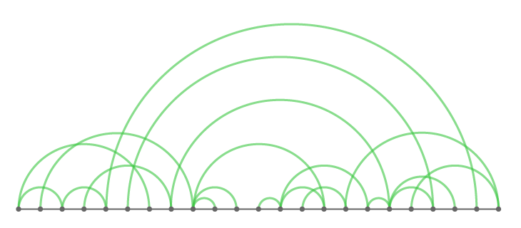
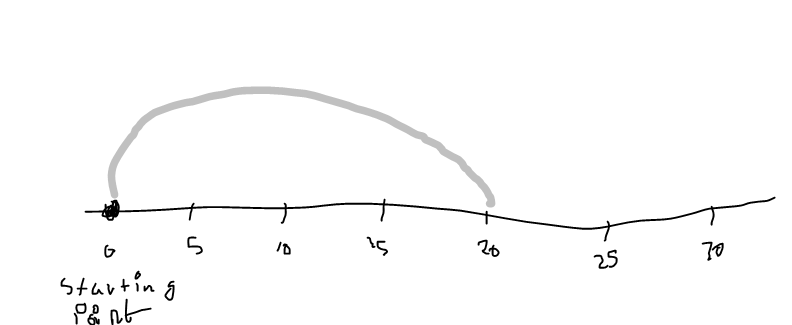
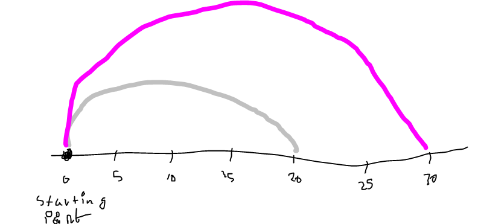
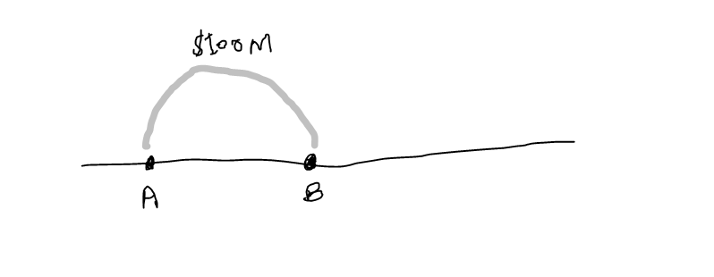
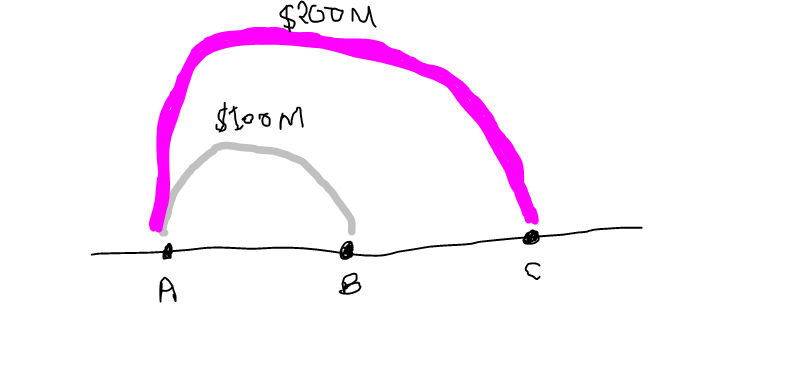
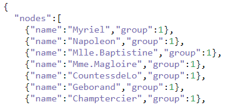
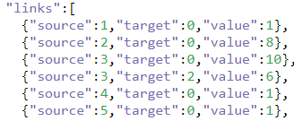
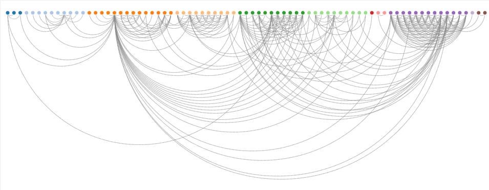
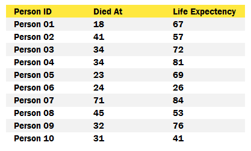
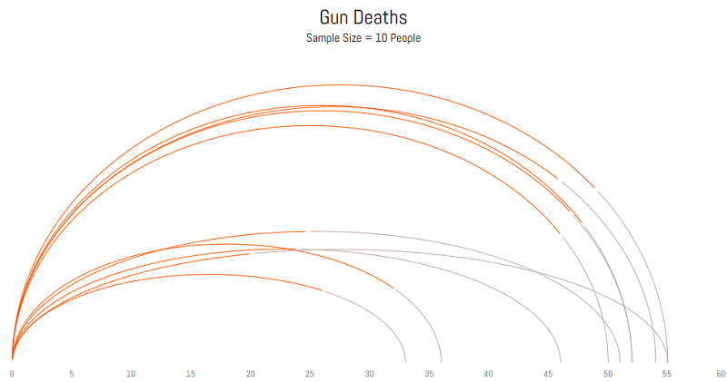

# MOS5.5 Data Visualisation-Travail 1 :
  
 # ARC Diagram
  
  ## I - Description
  
 
   
  Le diagramme " ARC Diagram " est une maniére pour représenter un diagramme réseaux à deux dimensions. 
  Dans un ARC Diagram, les noeuds sont placées tous au long d'une ligne (un simple axe qui représente la 1ére dimension)
  et les arcs sont utilisés pour montrer les connections entre les divers noeuds.
    
  
  Dans certaions cas on peut utilisé l'épaisseur  de chaque arc comme un indicateur sur la nature de la connection entre les noeuds       (exemple : fréquence) noeud source et noeud destination .
  
  ARC Diagram est trés utilisé pour clairement lire la coocurrence dans les données.
  
  Le point faible de ce type de diagramme (comme le plupart des graphique à deux dimensions) qu'il peut devenir illisible dans le cas on   aura plusieurs connections entre les noeuds : probléme de chevauchement et d'encombrement.
  ## II - Types de "ARC Diagram" :
   En géneral on a deux types principaux de ARC Diagram :
  - arc diagrams à noeuds continue. 
  - arc diagrams à noeuds discréts.
   ### 1) Arc diagrams à noeuds continues :
   Considérant un joueur entrain de lancer un poids d'une distance d à partir d'un point de départ s :
   lancée 1: Distance 20 Métres
   On peut visualiser la lancée de ce joueur en utilisant un arc diagram :
   
   Lancée 2: Distance 30 Métres
   ci-dessous comment elle se présnte la deuxiéme lancée:
   
   Great! So the point here to be considered is that in continuous nodes arc diagram, 
   Parfait! alors le point ici est considéré 
   les noeuds ne sont pas les sujets  (Lancées) mais ils sont l'ordre de grandeur des sujets (distance). et pour chaque sujet, on les dessines séparément (deux arcs pour deux lancées, 10 lignes pour 10 lancées). alors, les noeuds des arcs finir de devenir sur une ligne continue avec échelle.
   
   ### 2) Arc diagrams à noeuds discréts :
   Maintenant on va prendre l'exemple de la commerce entre deux pays A et B :
   
Commerce 1: Les pays B & A réalisent un commerce mutuel de 100 millions de dollars.
Le commerce peut être visualisé en utilisant un diagramme d'arc.
     
Commerce 2: Les pays B & C réalisent un commerce mutuel de 200 millions de dollars.
C'est ainsi que le commerce 2 se penchera en couches sur le dessus du commerce 1
      
     Encore une fois, maintenant, si vous remarquez, il y a quelques différences ici.  Les nœuds sont discrets (nom du pays) et la distance entre deux nœuds successifs est toujours la même. Et aussi, la magnitude (quantité commerciale) est indiquée en utilisant la largeur de l'arc (plus la quantité de commerce, plus l'arc est large).  En plus de cela, aussi l'ordre technique des nœuds n'a pas d'importance dans le graphique (le graphique afficherait toujours des valeurs correctes si les pays étaient classés comme C, B, A) mais l'ordre pourrait être important pour rendre le graphique plus efficace ( plus à ce sujet plus tard). 

  
  ## III - Exemples 1 (D3) :
  
  ### 1) Données :
  
  <i>Fichier JSON</i>
  On a un fichier JSON ou les données sont structuré de la façon suivante:
  Un objet JSON comportant deux tableaux :
 <table>
  <tr><th> -Tableaux noeuds :</th><td></td></tr>
 
  <tr><th> -Tableaux arcs : </td><td></td></tr>
 </table>
  Le tableau noeuds comporte des objets chaque objet a un attribut name (nom de la personne) et un attribut group ( le groupe à lequel appartient une personne) l'attribut groupe varie entre 1 et 8.
  Ci - dessous le resultat final qu'on veux obtenir :
   
 

   ### 2)  Code D3 : 
  <i>Si vous étes intéressé par ce diagram vous pouvez découvrir le code pour l'utilisé avec la bibliothéque de javascript JS</i>
  <a href='http://bl.ocks.org/sjengle/5431779'>Pour le reste de code cliquez ici  </a>
  
  ## VI - Exemples 2 (Tableau) :
  Dans notre exemple, nous allons utiliser ces données (imaginaires):
   
   Notre but et de créer un arc diagram comme celui ci :
   
   Où la trajectoire orange est l'âge de cette personne et la trajectoire gris est l'âge que cette personne aurait pu vivre si la          personne n'avait pas été tué.
   Étape: 1: Préparer les données
Répliquez le jeu de données 180 fois pour créer une courbe régulière. Donc, dans nos nouvelles données, nous aurons 10 personnes 180 fois = 1800 lignes *. Les données nouvellement créées ressembleront à ceci:
   
  Téléchrgez les données à partir <a href="https://www.doingdata.org//s/arcdata-tall.csv"> d'ici</a>  
  Étape 2: Créer des champs calculés 
Créer un champ calculé x: 
((COS([Point] * PI() / 180)) + 1 ) * [Life Expectency] / 2  
Créer un champ calculé y:  
(((SIN([Point] * PI() / 180)) * [Life Expectency] / 2) * [Died At]) / {MAX([Died At])}  
Créer un champ calculé Statut:  
[x] <= [Died At]  
Étape: 3:  
<ul>
<li>Configurer le graphique</li>
<li>Glisser x sur l'étagère des colonnes</li>
<li>Clic droit sur la pilule x et la convertir en dimension</li>
<li>Glisser sur l'étagère des lignes</li>
<li>Clic droit sur la pilule y et la convertir en dimension</li>
<li>Convertir le type de marques de Automatique à Ligne</li>
<li>Faites glisser l'ID de personne au détail</li>
<li>Faites glisser le point vers le chemin</li>
<li>Cliquez avec le bouton droit de la souris sur la pillule Point et convertissez-la en dimension</li>
<li>Glisser le statut sur la couleur</li>
<li><li>Effectuez la mise en forme finale et ajoutez des astuces, le cas échéant</li>
</ul>
Et c'est fini !  
  ## V - Sources

  <a href='http://bl.ocks.org/sjengle/5431779'>Exemple complet D3</a>[1] 
  <a href="https://www.doingdata.org/blog/how-to-create-an-arc-diagram-in-tableau/s/arcdata-tall.csv">Exemple complet Tableau</a>[2]
